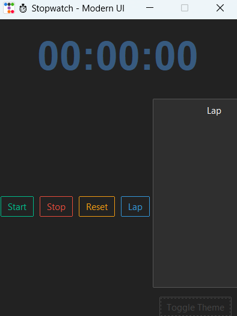
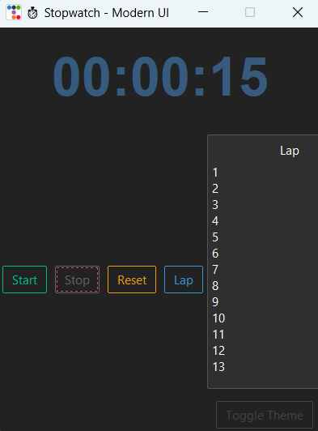
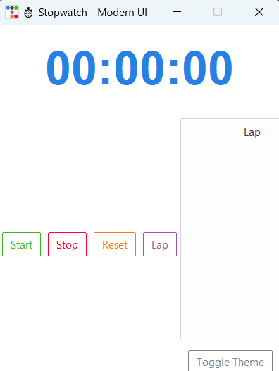

```md
⏱️ Stopwatch App (Python & Tkinter)

A simple yet powerful stopwatch built using Python and Tkinter. This application allows users to start, stop, reset, record lap times, and export lap data to a CSV file for further analysis.

🚀 Features

✅ Start, Stop, Reset functionality  
✅ Lap timing and display with multiple laps  
✅ User-friendly GUI built with Tkinter  
✅ Minimalist and responsive design  
✅ Export lap times to a CSV file  

📥 Installation & Usage

1️⃣ Clone the Repository  
```sh
git clone https://github.com/kabilesh-c/Stopwatch-Project.git
cd Stopwatch-Project
```

 2️⃣ Create a Virtual Environment (Recommended)  
For Windows:
```sh
python -m venv venv
venv\Scripts\activate
```
For macOS/Linux:
```sh
python3 -m venv venv
source venv/bin/activate
```

3️⃣ Install Dependencies  
```sh
pip install -r requirements.txt
```

4️⃣ Run the Application  
```sh
python src/stopwatch.py
```

---
🖼️ Screenshots  

🔵 Dark Mode  
  

🟢 Lap Stop  
  

⚪ Light Mode  
  

---

🛠️ Technologies Used  
- Python - Core functionality  
- Tkinter - GUI framework  
- CSV Module - Exporting lap data  

📜 License  
This project is open-source and available under the MIT License.

---

🙌 Contributing  
If you would like to contribute, feel free to fork the repository and submit a pull request.

Happy Coding! 🚀  
```
